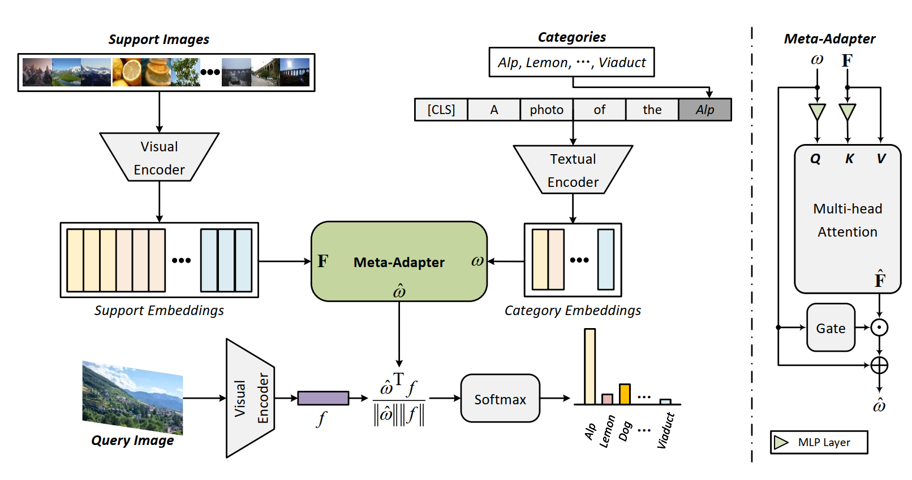

# Meta-Adapter: An Online Few-shot Learner for Vision-Language Model

Cheng Cheng, [Lin Song](http://linsong.info), Ruoyi Xue, Hang Wang, [Hongbin Sun](https://gr.xjtu.edu.cn/en/web/hsun/home), [Yixiao Ge](https://geyixiao.com), [Ying Shan](https://www.linkedin.com/in/YingShanProfile)

Meta-Adapter, a new few-shot learning method for CLIP, targets to overcome the limitations of previous methods in terms of poor generalization ability and low efficiency. 
The Meta-Adapter, employing a meta-testing mechanism and a lightweight residual-style network, extracts knowledge from few-shot samples without the need for additional fine-tuning, thus alleviating the over-fitting issue while maintaining high efficiency. 


[Arxiv Paper](https://arxiv.org/pdf/2311.03774.pdf)

## Installation
---
1. This code is built on top of the toolbox [Dassl.pytorch](https://github.com/KaiyangZhou/Dassl.pytorch) so you need to install the `dassl` environment first. Simply follow the instructions described [here](https://github.com/KaiyangZhou/Dassl.pytorch#installation) to install `dassl` as well as PyTorch.

2. Follow [guidelines](https://github.com/KaiyangZhou/CoOp/blob/main/DATASETS.md) to install the datasets.

3. torch>=2.0.0, cuda==11.8


## Model Zoo
----

1. The pre-trained weights of Meta-Adapter on ImageNet based on RN50, RN101, ViT-B/16 and ViT-B/32 can be downloaded altogether via this [link](https://drive.google.com/drive/folders/1esyFhs4gj9cEZoFo6B45Mp3eMmsuxwW-?usp=drive_link). The weights can be used to reproduce the results in Table 3 of Meta-Adapter's paper.

2. Quantitative results on other datasets are as follows:

| Model          | SUN397 | UCF101 | Caltech101 | DTD | FGVCAircarft | EuroSAT | Oxford_Pets |
|:----:          |:------:|:------:|:----------:|:---:|:------------:|:-------:|:-----------:|
| Zero-Shot CLIP |  29.0  | 21.1   |   60.6     |10.0 |  0.4         | 4.2     |  84.0       |
| Meta-Adapter   |  52.7  | 52.3   |   71.5     |49.2 |  19.6        | 66.7    |  87.0       |


## Getting Start
----

### Validate

1. change `root_path` in `$DATA.yaml`, the default configurations are `shots=16` and `backbone=RN50`;
2. run `python main.py --config ./configs/$DATA.yaml`;


## Ref
[1]: Zhang, Renrui, Wei Zhang, Rongyao Fang, Peng Gao, Kunchang Li, Jifeng Dai, Yu Qiao, and Hongsheng Li. "Tip-adapter: Training-free adaption of clip for few-shot classification." In European Conference on Computer Vision, pp. 493-510. Cham: Springer Nature Switzerland, 2022. https://arxiv.org/pdf/2207.09519.pdf

[2]: Gao, Peng, Shijie Geng, Renrui Zhang, Teli Ma, Rongyao Fang, Yongfeng Zhang, Hongsheng Li, and Yu Qiao. "Clip-adapter: Better vision-language models with feature adapters." International Journal of Computer Vision (2023): 1-15. https://arxiv.org/pdf/2110.04544.pdf

[3]: Zhou, Kaiyang, Jingkang Yang, Chen Change Loy, and Ziwei Liu. "Learning to prompt for vision-language models." International Journal of Computer Vision 130, no. 9 (2022): 2337-2348. https://arxiv.org/pdf/2109.01134


## Acknowledgement

If you find Meta-Adapter helpful, please cite:
```
@inproceedings{cheng2023meta,
  title={Meta-Adapter: An Online Few-shot Learner for Vision-Language Model},
  author={Cheng, Cheng and Song, Lin and Xue, Ruoyi and Wang, Hang and Sun, Hongbin and Ge, Yixiao and Shan, Ying},
  booktitle={Thirty-seventh Conference on Neural Information Processing Systems},
  year={2023}
}
```